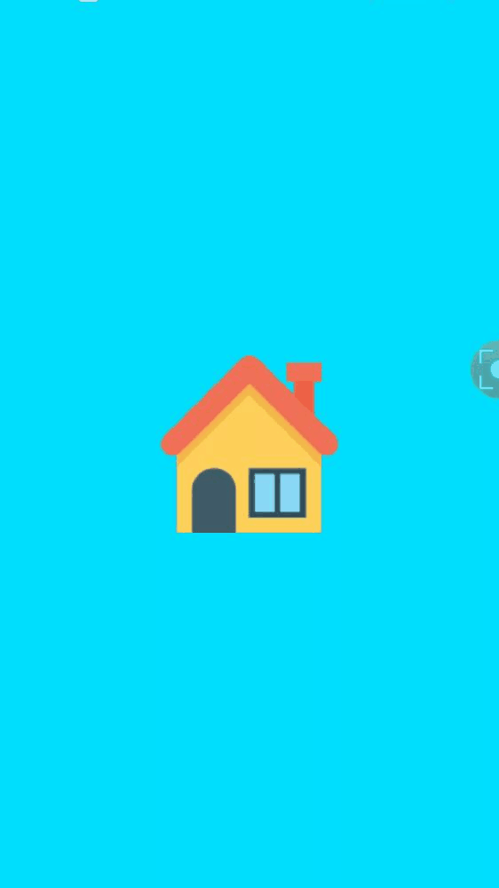

# Splash Screen Best Implimentation

This project is for learning how to make splash screen in android.
### No need any activity for splash screen
</br>

### 1. Make custom `theme` in `styles.xml` file
```java
<style name="AppTheme.Launcher">
        <item name="android:windowBackground">@drawable/launcher_screen_with_logo</item>
        <item name="android:windowNoTitle">true</item>
        <item name="android:windowActionBar">false</item>
        <item name="android:windowFullscreen">true</item>
        <item name="android:windowContentOverlay">@null</item>
    </style>
```
</br>

### 2. Make custom `drawable file` in `drawable` folder
```java
<?xml version="1.0" encoding="utf-8"?>
<layer-list xmlns:android="http://schemas.android.com/apk/res/android"
    android:opacity="opaque">
    <item android:drawable="@android:color/holo_blue_bright" />

    <item>
        <bitmap
            android:gravity="center"
            android:src="@drawable/home" />
    </item>
</layer-list>
```
</br>

### 3. Now add the custom theme in `AndroidManifest.xml` file for our launcher MainActivity.
```java
<activity android:name=".MainActivity"
            android:theme="@style/AppTheme.Launcher">
            <intent-filter>
                <action android:name="android.intent.action.MAIN" />

                <category android:name="android.intent.category.LAUNCHER" />
            </intent-filter>
        </activity>
```
</br>

### 4. At last, In our `MainActivity.java`, just add the theme before calling `onCreate()`
```java
@Override
    protected void onCreate(Bundle savedInstanceState) {
        setTheme(R.style.AppTheme);
        super.onCreate(savedInstanceState);
        setContentView(R.layout.activity_main);
        getSupportActionBar().setTitle("Home");
    }
```
</br>

### Screenshot

